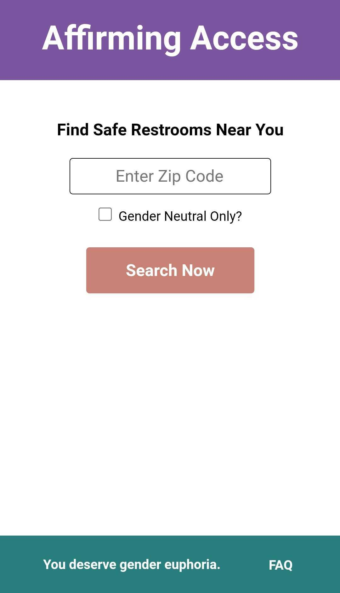

# Affirming Access

Affirming Access provides safe and affirming restroom access for transgender, intersex, and gender nonconforming individuals.

[It can be accessed here.](https://affirming-access.surge.sh/)

## Motivation

Why is this important?

According to respondents of the [US Transgender Survey](https://www.ustranssurvey.org/):
- 59% avoided using a restroom for fear of confrontation
- 31% avoided eating/drinking to avoid restrooms
- 24% had their presence in the restroom questioned
- 12% were harassed, attacked, or sexually assaulted in a restroom
- 9% were denied restroom access
- 8% developed a kidney issue or UTI from avoiding restrooms

## Rubric

This project was completed as a project at Turing School of Software & Design during Module 3.

[The rubric is linked here.](https://frontend.turing.edu/projects/module-3/showcase.html)

The goals and objectives were to use the technology we’ve been working with over the course of the module to demonstrate mastery React, Router, Asynchronous JavaScript, end-to-end testing with Cypress, and creating personas and user stories to describe a target audience.

## Reflections

A challenge was working out stubbing.

Big successes were Router, API calls, data cleaning, and getting stubbing to work.

## Languages and technology

Utilizes JavaScript, React, CSS, HTML/JSX, NPM, Node, Cypress, Normalizer, & Surge

Built with Visual Studio Code

[Code stored on GitHub](https://github.com/hayleyw7/affirming-access)

[Project board on GitHub](https://github.com/hayleyw7/affirming-access/projects/1) 

## Access and use website

Visit the site [here](https://affirming-access.surge.sh/).

To read more about the site, select "FAQ" at the bottom right of the page.

To access restrooms, the user must enter the zip code where they are located, choose whether or not to check the "Gender Neutral Only?" box, and then click "Search Now".

They will be presented up to five of the closest restrooms that users deemed as safe to them.

To do additional searches, they user just enters searches for another zipcode, using the steps above.

## Screenshots

### Mobile

  
  
  

### Desktop

  
  
  

### Error handling & Loader

  
  
  

## Future additions

* I will implement 404 and 500 error pages.

* I will add geolocation.

## Contributors

Project completed by [Hayley Witherell](https://github.com/hayleyw7)

Project designed by instructors at Turing School of Art & Design

APIs by [Zippopotam.us](https://zippopotam.us/) & [Refuge Restrooms](https://www.refugerestrooms.org/)
